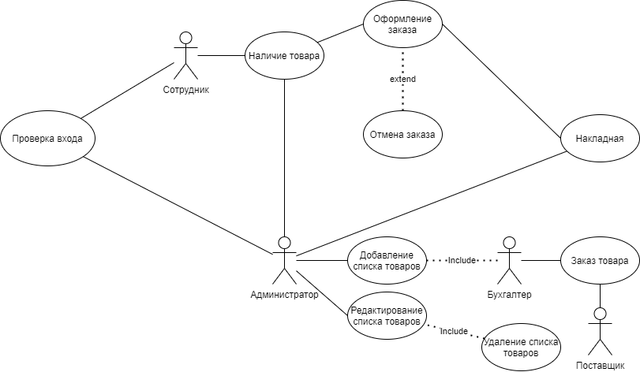
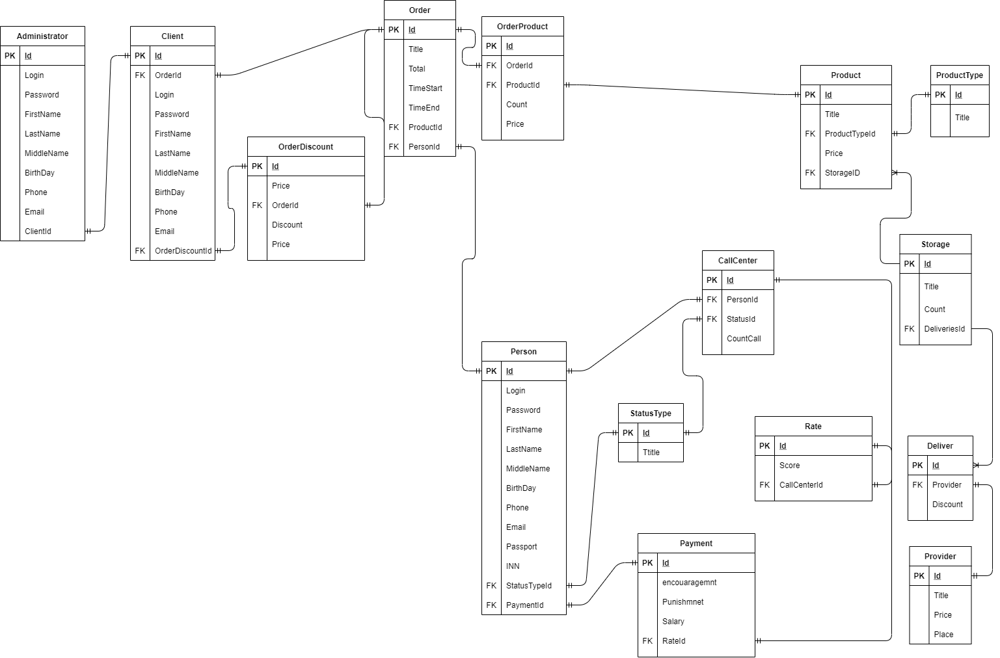
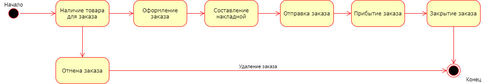
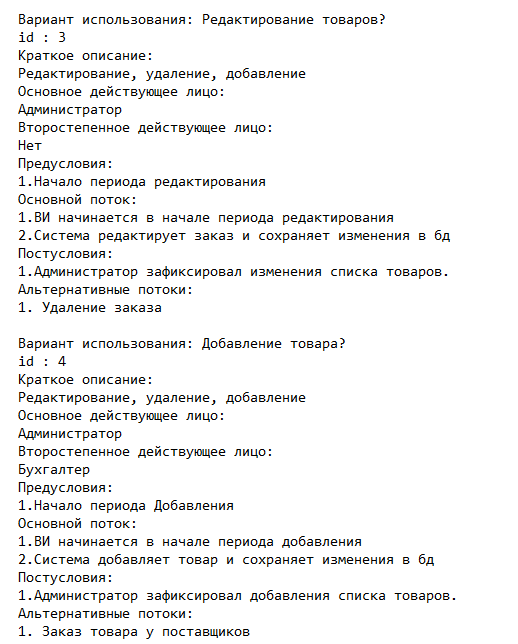

<table style="width: 100%;">
  <tr>
    <td style="text-align: center; border: none;"> 
        Министерство образования и науки РФ  
        ГБПОУ РМЭ "Йошкар-Олинский Технологический колледж 
    </td>
  </tr>
  <tr>
    <td style="text-align: center; border: none; height: 45em;">
        <h2>
            Курсовой проект  
            "Проектирование и разработка информационных систем"  
            для группы И-31
        <h2>
    </td>
  </tr>
  <tr>
    <td style="text-align: right; border: none; height: 20em;">
        

            <b>Разработал</b>:  
            Новосёлов Кирилл Алексеевич  
            <b>Проверил</b>:  
            Колесников Евгений Иванович
        

    </td>
  </tr>
  <tr>
    <td style="text-align: center; border: none; height: 1em;">
        г.Йошкар-Ола, 2021
    </td>
  </tr>
</table>

https://github.com/kirknovos/Kursovoy_Project

# Содержание

* [Теоретическая часть](#Теоретическая-часть)
* [Практическая часть, разработка бд](#Практическая-часть.-Разработка-БД)
* [Практическая часть, разработка кода ИС](#Практическая-часть.-Разработка-кода-ИС)

# Теоретическая-часть
## Диаграммы

### Предметная область Интернет провайдер.Подсистема работы с товарами.

### Диаграмма Use Case:

### Диаграмма ER:

### Диаграмма Состояний:

### CСпецификация прецентдентов Use Case:

